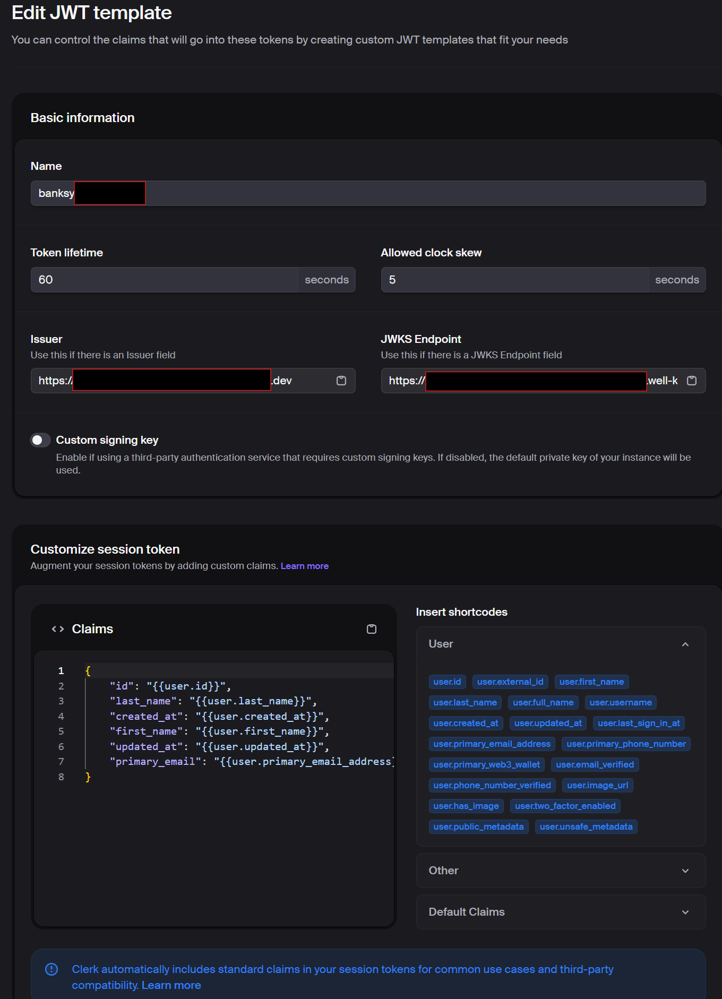

# Banksy – Full-Stack Banking MVP

Banksy is a **full-stack banking application MVP** built with:

To install you must install all submodules using the command below
```bash
git clone --recurse-submodules https://github.com/seanippolito/banksy.git
```

* **Frontend**: Next.js (App Router) + React 19 + Tailwind CSS v4 + Clerk for authentication
* **Backend**: FastAPI + SQLAlchemy + Alembic + SQLite (dev) / Postgres (prod)
* **DevOps**: Docker + Docker Compose + Poetry for Python dependency management

The application provides a simulated online banking platform with user authentication, accounts, transactions, money transfers, cards, account holders, and statements. It is designed as an **MVP** but with a production-ready foundation.

---

## ✨ Features Implemented

* **Authentication**

    * Clerk-based JWT validation between frontend and backend
* **Users**

    * Persisted on first login
* **Accounts**

    * Create, list, view by ID
    * Primary holder automatically assigned
* **Transactions**

    * Create debit/credit transactions
    * List per account
* **Money Transfers**

    * Double-entry style (debit sender, credit recipient)
* **Cards**

    * Ship new cards (simulated digital cards linked to accounts)
* **Account Holders**

    * Add/remove account holders (Primary, Joint, Business, Trust, etc.)
* **Statements**

    * Dynamic generation (date-filtered, aggregated transactions)
* **Error Logging**

    * ApplicationLogger DB table for error capture
    * `/api/v1/errors` endpoint for reporting
* **Frontend**

    * Dashboard with user profile + accounts
    * Accounts page with create/view accounts
    * Account detail with holders, cards, statements
    * Transactions page with debit/credit entry
    * Money transfers page
    * Error reporting UI

---

## 🛠️ Prerequisites

* Node.js 20+
* Python 3.12+
* [Poetry](https://python-poetry.org/) (Python dependency manager)
* Docker + Docker Compose
* Clerk account (for authentication)
* Make install for easy docker run

---

## ⚙️ Environment Variables

Create a `.env.local` for local runs, `.env.development` for docker development runs, `.env.production` for docker production runs file in the backend, frontend, and for docker ensure the .env files are copied into the root directory:
The test_db also needs a separate `.env.test` for testing on a separate standalone database that doesn't impact the development database

You must create an account with Clerk to enable User Authentication or the App won't run do to missing .env keys.
In addition to creating an account you will need to generate a JWT Template to communicate with the database securely. See the image below for assistance. 



### Backend `.env`

```env
DATABASE_URL=sqlite+aiosqlite:///./data/banksy.db
CLERK_JWKS_URL=https://<your-clerk-instance>/.well-known/jwks.json
CLERK_JWT_ISSUER=https://<your-clerk-instance>/
CLERK_AUDIENCE=banksy-backend
```

### Frontend `.env.local`

```env
NEXT_PUBLIC_API_URL=http://localhost:8000
CLERK_PUBLISHABLE_KEY=<your-publishable-key>
CLERK_SECRET_KEY=<your-secret-key>
```

---

## 💾 Database Setup

Banksy stores its data in `banksy.db` (SQLite in development).

### Data Directory

```bash
mkdir -p apps/backend/data
```

### Run Migrations

```bash
cd apps/backend
poetry install
poetry run alembic upgrade head
```

### Seed Basic Data

Backend service must be running in docker to seed the account. 

```bash
make seed
```

---

## 🚀 Running the Application

### Local Development (without Docker)

1. Start backend

   ```bash
   cd apps/backend
   poetry install
   make run
   ```
   if make is not installed run through poetry
   ```bash
   poetry run uvicorn app.main:app --reload --host 127.0.0.1 --port 8000
   ```

2. Start frontend

   ```bash
   cd apps/frontend
   pnpm install
   pnpm dev
   ```

3. Start both at same time from root directory (banksy) using concurrently
Changes to backend will cause the backend app to hot reload, crashing the frontend app that is reliant on the backend being up

  ```bash
  pnpm install
  pnpm dev
  ```

Access:

* API: [http://localhost:8000](http://localhost:8000)
* API docs: [http://localhost:8000/docs](http://localhost:8000/docs)
* Frontend: [http://localhost:3000](http://localhost:3000)

---

### Docker Development Environment

From the root directory ./banksy

The Docker dev environment will wipe the database everytime it is shutdown, starting with a clean dev environment for testing. 
```bash
make dev
```

Runs both frontend + backend in containers with live reload.

---

### Docker Production Environment

The Docker production environment persists the database everytime it is shutdown, preserving your data.
```bash
make up
```

Runs production builds for both services.

---

### Docker Graceful Shutdown Environment

Tears down the Docker environment. 
```bash
make down
```

Works on both production and development docker instances

---

## 📖 API Documentation

FastAPI provides interactive API docs at:

👉 [http://localhost:8000/docs](http://localhost:8000/docs)

---

## 🧪 Testing

Run backend tests with coverage report included:

```bash
cd apps/backend
poetry run pytest -v
```
In-memory SQLite is used for testing to isolate from dev/prod data.

---

Run frontend tests with vitest, currently only 1 test implemented to demonstrate framework knowledge, need to add more tests in future development.

```bash
cd apps/frontend
pnpm install
pnpm vitest
```

---

## 🔮 Next Steps

* Improve test coverage (currently ~65%) to %80 in the backend
* Add more tests to cover all API calls in the frontend (ran out of time to cover this)
* Add real card tokenization/PCI-safe mock layer
* Enable Clerk production mode to enhance security
* Expand statements (export to PDF/CSV)
* Implement scheduled/recurring transfers
* UI polish (charts, analytics)
* Deployment pipeline (CI/CD to cloud)
* Multi-tenant support

---
